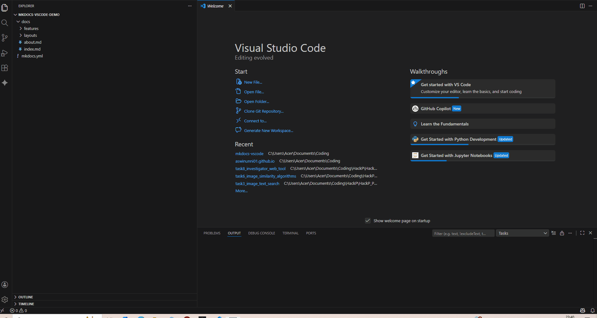

# MkDocs Preview for VS Code 🚀

[](https://marketplace.visualstudio.com/)
[](https://opensource.org/licenses/MIT)

**MkDocs Preview** is a powerful, production-grade VS Code extension designed to streamline your documentation workflow. It spins up a live MkDocs server in the background and provides an integrated, side-by-side preview directly within your editor.

---

## ✨ Key Features

- **🚀 One-Click Preview**: Start your MkDocs server instantly from the Status Bar, Command Palette, or the `mkdocs.yml` editor title bar.
- **🖥️ Integrated Side Panel**: Browse your live documentation in a dedicated VS Code side panel—no more switching back and forth to your browser.
- **🛠️ Managed Background Service**: Powered by Node.js `spawn`, providing direct process control, automatic cleanup, and crash resilience.
- **📜 Real-time Logs**: Monitor your server's health through a professional Output Channel (`MkDocs Preview Logs`).
- **⚙️ Dynamic Configuration**: Easily change your server port through VS Code settings with real-time "Restart Now" prompts.
- **🎨 Modern Aesthetic**: A minimalist, system-native UI that respects your VS Code theme and typography.

---

## 📸 Demo


---

## 🛠️ Requirements

Before using this extension, ensure you have the following installed:

1.  **VS Code**: Version `1.109.0` or later.
2.  **Python 3.8+**: [Download Python](https://www.python.org/downloads/).
3.  **MkDocs**: Install it via pip:
    ```bash
    pip install mkdocs
    ```
    *Note: We recommend using the Material theme for the best experience:* `pip install mkdocs-material`

---

## 🚀 Getting Started

1.  Open a workspace that contains an `mkdocs.yml` file.
2.  Look for the **$(book) MkDocs** item in the bottom-left Status Bar.
3.  Click it to start the preview server.
4.  Optionally, open the **MkDocs Sidebar** (Telescope icon) to view the documentation side-by-side with your Markdown files.

---

## ⚙️ Extension Settings

This extension contributes the following settings:

*   `mkdocs-vscode.port`: Set the port number for the live preview server (default: `8000`).

---

## 🚦 Commands

*   `MkDocs: Start Preview`: Starts the server and opens the preview browser.
*   `MkDocs: Stop Preview`: Gracefully shuts down the background server.

---

## 🚥 CI/CD: Fully Automated Deployment (Level 3)

This extension uses a **"Zero-Touch"** CI/CD pipeline via GitHub Actions.

1.  **Automated Workflows**: 
    *   **Continuous Integration**: Every Push or Pull Request triggers a multi-OS build and test suite.
    *   **Continuous Deployment**: Every push to the `main` branch automatically:
        1.  Calculates the next version (defaulting to a `patch` bump).
        2.  Creates and pushes a new GitHub tag (e.g., `v0.0.3`).
        3.  Builds, packages, and publishes the version to the VS Code Marketplace.

*Note: The `VSCE_PAT` secret must be configured in your GitHub repository secrets for the marketplace upload to succeed.*

---

## 🤝 Contributing

Contributions are welcome! If you find a bug or have a feature request, please open an issue on our [GitHub Repository](https://github.com/aswinunni01/mkdocs-vscode).

1.  Fork the repository.
2.  Create your feature branch (`git checkout -b feature/AmazingFeature`).
3.  Commit your changes (`git commit -m 'Add some AmazingFeature'`).
4.  Push to the branch (`git push origin feature/AmazingFeature`).
5.  Open a Pull Request.

---

## 📄 License

Distributed under the MIT License. See `LICENSE` for more information.

---

**Built with ❤️ for the MkDocs community.**
